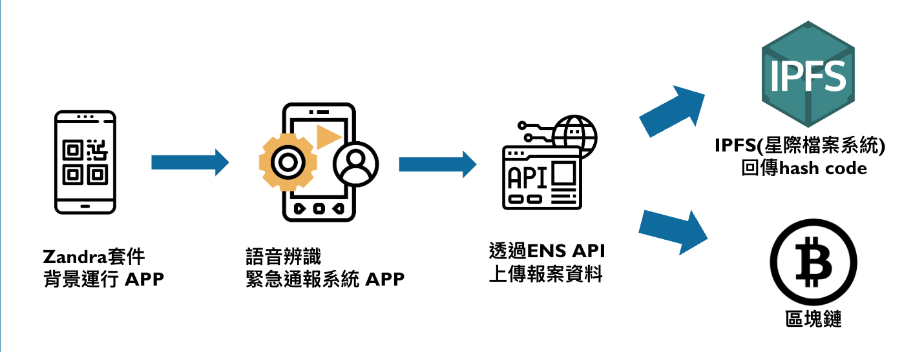

# EchoGuard

Leveraging the ubiquity of smartphones, this project introduces an "Emergency Reporting System Powered by Voice Recognition and Blockchain Technology." Designed for immediate, hands-free activation via voice commands during crises, it aims to swiftly locate and summon aid, minimizing the impact of accidents. Focused on enhancing campus safety, the system integrates Google's voice recognition on smartphones to facilitate report initiation without the need for dialing. Users simply voice out keywords, prompting the system to record the incident details and track their location via GPS and internet positioning. This data is then securely transmitted to the response center using blockchain technology, optimizing rescue operations.

Additionally, this system's utility extends to disaster prevention and reporting infractions, enabling users to report incidents hands-free, such as vehicle accidents on highways, thereby promoting safety without compromising the user's current activity.

## System Flow Chart

## System Architecture
Using the Flutter frontend development framework, with Android Studio 3.5 as the development tool, and Dart as the primary programming language. Smartphones such as the Zenfone 5Z (ZS620KL) and iPhone X are utilized as cross-platform testing tools, operating on Android 10.0 and iOS 13 or higher versions, respectively.

To enhance the completeness and rapid deployment of this application, we initially establish a private blockchain with an Ethereum-based Proof-of-Authority (PoA) consensus mechanism within this project. This approach provides greater flexibility for adjustments and experimentation during implementation, facilitating subsequent observation and development.

## Result
We fully implement a voice recognition-based reporting system on mobile devices, utilizing blockchain technology in conjunction with the IPFS distributed database for data storage and verification in the backend. This effectively provides a reporting platform that balances efficiency, security, credibility, and user-friendliness. By integrating the Flutter frontend framework, the system is made accessible to users across different operating systems. In collaboration with police and fire departments, it achieves proactive campus safety deployment and enhances emergency response capabilities.

